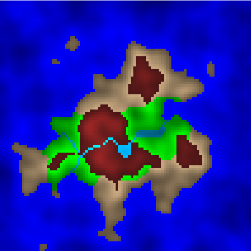
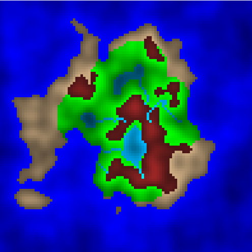
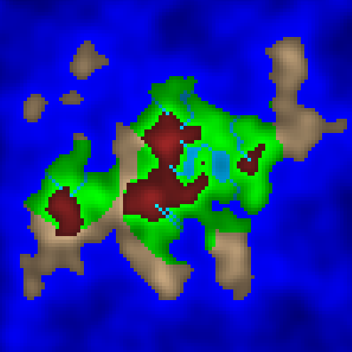

# continent-generation
This is my Perlin-Noise-based terrain generation algorithm. There are many like it, but this one is mine.

The algorithm goes something like this:
1. Create an elevation grid:
    1. Make a shallow dome in the center of the grid. (This is to make sure the highest points are all clustered around the middle of the grid.)
    2. Apply a few octaves of Perlin Noise.
2. Compute bodies of water:
    1. Choose an arbitrary elevation to be sea level. Every point whose elevation is below sea level is a body of water.
    2. The outer body of the water is the ocean.
    3. Landlocked bodies of water are lakes.
3. Compute mountains:
    1. Choose an arbitrary elevation to be mountain level. Every point whose elevation is above mountain level is a mountain.
4. Generate rivers:
    1. Randomly select some mountain points to be river sources.
    2. For each source, generate a river by greedily searching down the elevation gradient to sea level.
5. Compute fields and deserts.
    1. Choose an arbitrary distance from fresh water.
    2. All land points within that distance of fresh water are fields. All land points outside that range are deserts.

## Demos

